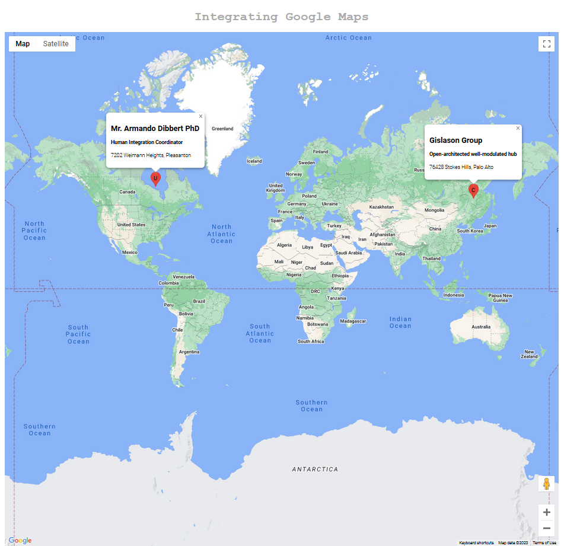

# Google Maps Implementation

Finished 09/01/2023.

A simple Typescript project placing two markers on a map (a user and a company) - with the ability to click them for additional information.

This was made as part of the Udemy Course, _Typescript: The Complete Developer's Guide_ in Section 9, "Design Patterns with Typescript". I did make some modifications (including the lettering on the markers to represent Users and Companies, and the additional information included in the Marker Label.)

Please note (as you can see), this application uses dummy data from Faker and the map positions are based on the provided latitudes and longitudes, not the address data. These are not synced, which is why Palo Alto is placed in Siberia instead of in California.

Occasionally the data is unreliable and one marker will generate beyond the possible latitude and longitude accepted by Google Maps - if one or both markers are missing, please refresh the page.

## TO DOS:

This is largely a project to improve my skills of TS, so I don't have grand plans at the moment. I would like to use the Google Maps developer tools again, perhaps to dabble in the "get directions" section.

For this app, I'd like to improve the visuals as the site as a whole is very plain. I'd potentially like to be able to include more user data or company data in pop-ups.

I would like to change the colour of the markers (as the U and C are not quite ideal) but this requires importing marker images which isn't great either!
